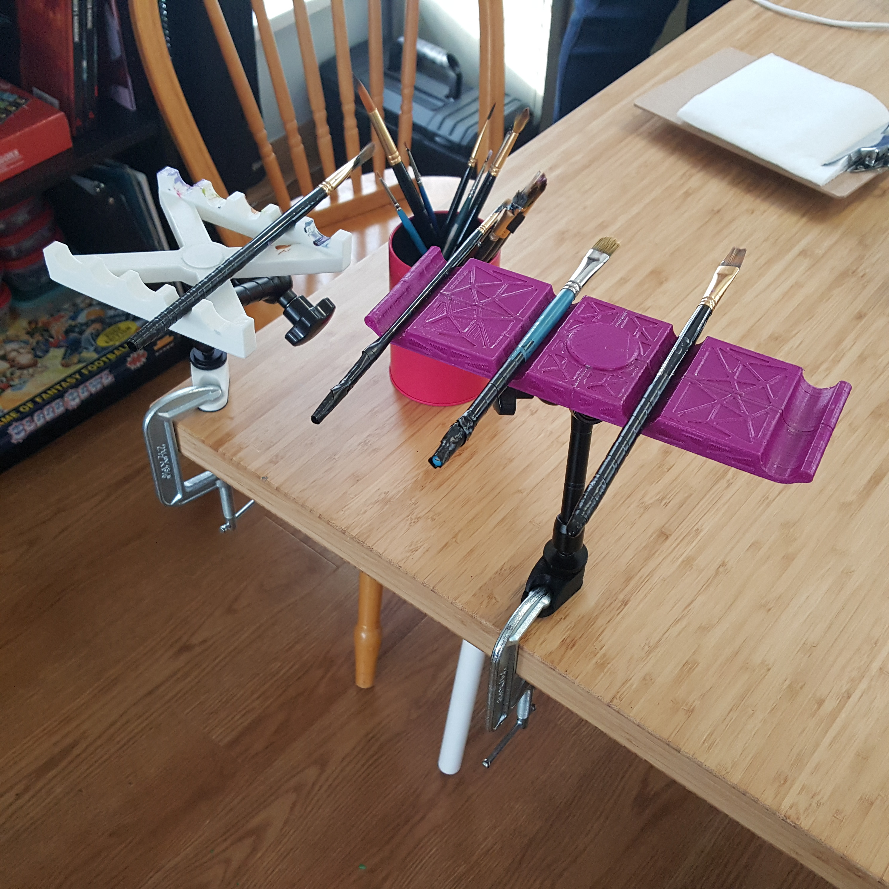

#  Horizontal Paintbrush Stand
This is a paintbrush stand designed for use by a Mouth Painter. The Horizontal Paintbrush Stand has a series of spaced horizontal slots to rest the brush during use and enable the painter to switch between brushes independently. The stand has a female 1/4"-20 UNC connection for mounting using commercially available camera mounting equipment.

## More info at
- [Makers Making Change Project Page](https://makersmakingchange.com/project/horizontal-paintbrush-stand/)

## How to Obtain a Horiztonal Horizontal Paintbrush Stand

### 1. Do it Yourself (DIY) or Do it Together (DIT)

This is an open-source assistive technology, so anyone is free to build it. All of the files and instructions required to build the Horizontal Paintbrush Stand are contained within this repository. Refer to the Maker Guide below.

### 2. Request a build of this device

To get matched up with a volunteer maker to build the device, you can submit a build request through the [MMC Library Page](https://makersmakingchange.com/project/horizontal-paintbrush-stand/). As the requestor, you will be responsible for the cost of materials and any shipping.

### 3. How to build this device for someone else

If you have the skills and equipment to build a device like this and would like to donate your time to create the switch for someone who needs it, visit the [MMC Maker Wanted](https://makersmakingchange.com/maker-wanted/) section to get in touch with a user.

## Files
### Documentation
| Document             | Version | Link |
|----------------------|---------|------|
| Design Rationale     | 0.2     | [Horizontal-Paintbrush-Stand__Design_Rationale](/Documentation/Horizontal-Paintbrush-Stand_Design_Rationale_v0.2.pdf)  |
| Maker Guide          | 0.2    | [Horizontal-Paintbrush-Stand__Maker_Checklist](/Documentation/Horizontal-Paintbrush-Stand_Maker_Checklist_v0.2.pdf)    |
| Bill of Materials    | 0.2     | [Horizontal-Paintbrush-Stand__Bill_of_Materials](/Documentation/Horizontal-Paintbrush-Stand_BOM_v0.2.xlsx)             |
| User Guide           | 0.2     | [Horizontal-Paintbrush-Stand__User_Guide](/Documentation/Horizontal-Paintbrush-Stand_Quick_Guide_v0.2.pdf)   |
| Changelog            | 0.2     | [Horizontal-Paintbrush-Stand__Changelog](/Documentation/Horizontal-Paintbrush-Stand_Changelog_v0.2.pdf)                |

### Design Files
[CAD Files](/Design_Files)

### Build Files
 - [3D Printing Files](/Build_Files/3D_Printing)

## Attribution
Designed by Jake McIvor (Makers Making Change) in consultation with artist Kaileen Selig.

## License
Everything needed or used to design, make, test, or prepare the Horizontal Paintbrush Stand is licensed under the CERN 2.0 Permissive license <https://ohwr.org/project/cernohl/wikis/Documents/CERN-OHL-version-2> (CERN-OHL-P) . 

Accompanying material such as instruction manuals, videos, and other copyrightable works that are useful but not necessary to design, make, test, or prepare the Horizontal Paintbrush Stand are published under a Creative Commons Attribution-ShareAlike 4.0 license <https://creativecommons.org/licenses/by-sa/4.0/> (CC BY-SA 4.0).

## About Makers Making Change

Makers Making Change is an initiative of [Neil Squire](https://www.neilsquire.ca/), a Canadian non-profit that uses technology, knowledge, and passion to empower people with disabilities.

We are committed to creating a network of volunteer makers who support people with disabilities in their communities through 3D printing assistive devices. Check out our library of free, open-source assistive technologies with parts and build instructions.

 - Website: [www.MakersMakingChange.com](https://www.makersmakingchange.com/)
 - GitHub: [https://github.com/makersmakingchange](https://github.com/makersmakingchange)
 - Twitter: [@makermakechange](https://twitter.com/makermakechange)
 - Instagram: [@makersmakingchange](https://www.instagram.com/makersmakingchange)

### Contact Us

For technical questions, to get involved, or share your experience we encourage you to visit the [MMC Website](https://www.makersmakingchange.com/), [MMC Forum](https://makersmakingchange.com/forum), or contact info@makersmakingchange.com
